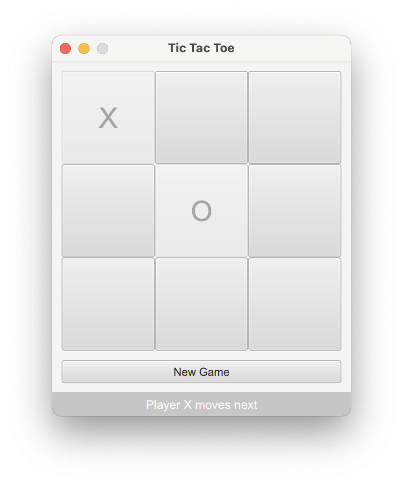

# Tic Tac Toe

The Tic Tac Toe game built with Clojure and JavaFX.



## Building the application with Leiningen
```bash
lein uberjar
```

## Starting the application
```bash
java -jar target/uberjar/tictactoe-1.0-standalone.jar
```

## Running the tests
```bash
lein test
```
